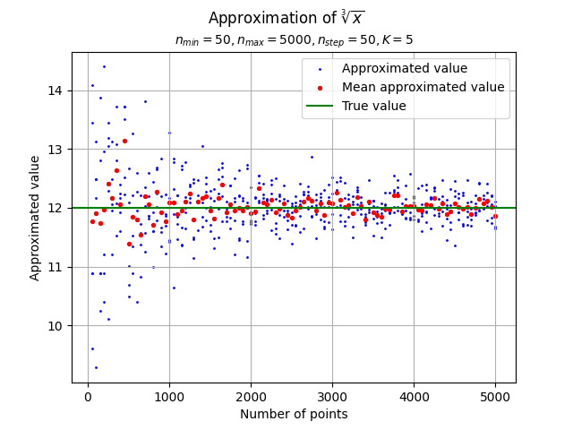
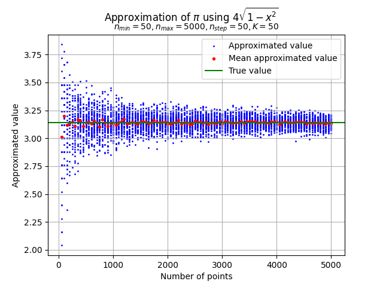

# MPiS - Zadanie Domowe 1
## Michał Waluś

### Zadanie 1

#### a)

- $\int_0^8 \sqrt[3]{x} \,dx = \int_0^8 x^{\frac{1}{3}} \,dx = \frac{3}{4}x^{\frac{4}{3}} \Big\rvert_{x=0}^8 = \frac{3}{4} \left(8^{\frac{4}{3}} - 0^{\frac{4}{3}} \right) = \frac{3}{4} \cdot 16 = 12$ 

  
  

- $\int_0^{\pi} \sin(x) \,dx = -\cos(x) \Big\rvert_{x=0}^{\pi} = -\left( \cos(\pi) - \cos(0) \right) = - \left( -1 - 1 \right) = 2$

  
  

- $\int_0^1 4x\left(1-x\right)^3 \,dx = 4 \int_0^1 \left(1-x\right)x^3 \,dx = 4 \int_0^1 \left(x^3 - x^4\right) \,dx = 4 \cdot \left( \frac{1}{4} x^4 - \frac{1}{5} x^5 \right) \Big\rvert_{x=0}^1 = 4 \cdot \left( \frac{1}{4} - \frac{1}{5} \right) = 1 - \frac{4}{5} = \frac{1}{5} = 0.2$

  
  

#### b)

Przybliżenie liczby $\pi$ używając $f(x) = 4\sqrt{1-x^2}$

  
  

