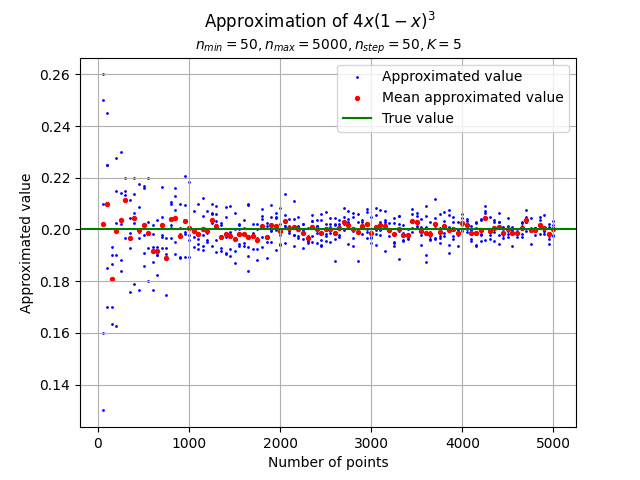
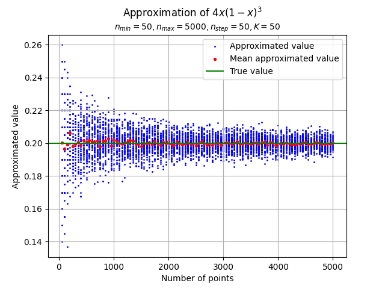

<h1 style="text-align: center">MPiS - Zadanie Domowe 1</h1>
<h1 style="text-align: center">Michał Waluś</h1>

## Zadanie 1

### a) Przybliżanie całek metodą Monte Carlo

### - $\int_0^8 \sqrt[3]{x} \,dx$

\[\int_0^8 \sqrt[3]{x} \,dx = \int_0^8 x^{\frac{1}{3}} \,dx = \frac{3}{4}x^{\frac{4}{3}} \Big\rvert_{x=0}^8 = \frac{3}{4} \left(8^{\frac{4}{3}} - 0^{\frac{4}{3}} \right) = \frac{3}{4} \cdot 16 = 12\]

  
  

### - $\int_0^{\pi} \sin(x) \,dx$

$\int_0^{\pi} \sin(x) \,dx = -\cos(x) \Big\rvert_{x=0}^{\pi} = -\left( \cos(\pi) - \cos(0) \right) = - \left( -1 - 1 \right) = 2$

  
  

### - $\int_0^1 4x\left(1-x\right)^3 \,dx$

$\int_0^1 4x\left(1-x\right)^3 \,dx = 4 \int_0^1 \left(1-x\right)x^3 \,dx = 4 \int_0^1 \left(x^3 - x^4\right) \,dx = 4 \cdot \left( \frac{1}{4} x^4 - \frac{1}{5} x^5 \right) \Big\rvert_{x=0}^1 = 4 \cdot \left( \frac{1}{4} - \frac{1}{5} \right) = 1 - \frac{4}{5} = \frac{1}{5} = 0.2$

  
  

### b) Przybliżenie liczby $\pi$ metodą Monte Carlo

Przybliżamy liczbę $\pi$ używając $f(x) = 4\sqrt{1-x^2}$.  
$\int_0^1 4\sqrt{1-x^2} \,dx = 4 \int_0^{\frac{\pi}{2}} \sqrt{1 - \sin^2x} \cdot \cos x \,dx = 4 \int_0^{\frac{\pi}{2}} \cos^2x \,dx = 4 \cdot \frac{\pi}{4} = \pi$

  
  

### Wnioski

Uzyskane wyniki pokazują, że dla każdej z przybliżonych funkcji, średni wynik uzyskany z 50 powtórzeń jest dokładniejszy niż ten dla 5. Dla większej ilości punktów także otrzymujemy wyniki bliższe do rzeczywistej wartości. Obie te rzeczy są zgodne z tym czego byśmy oczekiwali - przyliżenie jest generowane poprzez pseudo-losowo liczby, więc większa liczba wygenerowanych punktów umożliwia dokładniejsze przybliżenie pola pod wykresem, a zwiększenie liczby powtórzeń pozwala zmniejszyć wpływ wyników odstających od normy na ostateczny (uśredniony) wynik.  
Jeśli chcielibyśmy uzyskać jeszcze dokładniejsze przybliżenie, dla najlepszego wyniku, należało by zwiększyć ilość wygenerowanych punktów oraz liczbę powtórzeń algorytmu. Moglibyśmy także uniknąć wyników wyjątkowo odstających od normy, poprzez odrzucenie np. 10% wyników, 5% o największej wartości oraz 5% o najmniejszej i nie wliczaniu ich do średniej.  